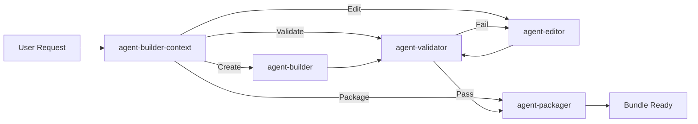

# Agent Coordination Template

## Purpose
Defines how agents trigger and communicate with each other to ensure seamless workflows without overlap.

## Agent Roles (No Overlap)

### agent-builder-context
**Primary Role**: Entry point with intelligent routing and context gathering
**Triggers**:
- User says: "I want to work with agents", "help me with agent [task]"
- Routes to appropriate specialist based on request analysis
**Triggers Next**: agent-builder, agent-editor, agent-validator, or agent-packager (based on routing analysis)

### agent-builder
**Primary Role**: Creates new agents from user requirements
**Triggers**:
- Via agent-builder-context routing for creation requests
- Direct user requests: "create an agent", "build an agent", "I need an agent for..."
- Outputs: New agent file(s) in workspace
**Triggers Next**: agent-validator (automatically after creation)

### agent-validator
**Primary Role**: Validates agent structure, dependencies, and quality
**Triggers**:
- After agent-builder creates new agent
- User says: "validate this agent", "check agent quality"
- File appears matching: `*-agent.md` or `*/agents/*.md`
**Triggers Next**: agent-packager (if validation passes)

### agent-packager
**Primary Role**: Creates self-contained bundles with all dependencies
**Triggers**:
- After agent-validator confirms agent is valid
- User says: "package this agent", "create bundle", "make portable"
- Multiple agent files need bundling
**Triggers Next**: agent-editor (if updates needed)

### agent-editor
**Primary Role**: Modifies and improves existing agents
**Triggers**:
- Via agent-builder-context routing for modification requests
- Direct user requests: "edit this agent", "improve", "update", "fix"
- Validation fails and fixes are needed
- Bundle needs updating with new features
**Triggers Next**: agent-validator (after edits complete)

## Triggering Methods (Multiple for Reliability)

### 1. Command-Based Triggers
```yaml
# In each agent's frontmatter
triggers:
  commands:
    - "create agent"
    - "build agent"
  next_agent: agent-validator
  pass_data:
    - created_file_path
    - agent_name
```

### 2. Hook-Based Triggers
```bash
# In user's settings/hooks
on_file_created:
  pattern: "*-agent.md"
  action: "run agent-validator on {{file}}"

on_task_complete:
  agent: agent-builder
  action: "run agent-validator on {{output}}"
```

### 3. File-Based Triggers
```yaml
# Watch for file patterns
file_triggers:
  - pattern: "created-agents/*/agents/*.md"
    action: validate
  - pattern: "*/validation-passed.flag"
    action: package
  - pattern: "*/package-complete.flag"
    action: ready_for_use
```

### 4. Output-Based Triggers
```yaml
# In agent output
---
AGENT_OUTPUT:
  status: success
  created_files:
    - /path/to/new-agent.md
  next_action: validate
  trigger_agent: agent-validator
---
```

### 5. TodoWrite-Based Triggers
```yaml
# When completing specific todos
on_todo_complete:
  pattern: "Create * agent"
  action: "add todo: Validate {agent_name}"

on_todo_complete:
  pattern: "Validate * agent"
  action: "add todo: Package {agent_name} into bundle"
```

## Inter-Agent Communication Protocol

### Data Passing Structure
```json
{
  "from_agent": "agent-builder",
  "to_agent": "agent-validator",
  "timestamp": "2025-01-13T10:00:00Z",
  "data": {
    "agent_path": "/created-agents/task-discovery/agents/task-discovery.md",
    "bundle_name": "task-discovery",
    "templates_used": ["todowrite-integration.md"],
    "validation_required": ["structure", "dependencies", "templates"]
  },
  "callback": {
    "on_success": "agent-packager",
    "on_failure": "agent-editor"
  }
}
```

### Workflow Example



## Preventing Overlap

### Clear Boundaries
- **Builder**: ONLY creates new agents
- **Validator**: ONLY checks quality (no fixes)
- **Editor**: ONLY modifies existing agents
- **Packager**: ONLY bundles validated agents

### Validation Checkpoints
```yaml
agent-builder:
  before_complete:
    - must_create_file: true
    - must_trigger: agent-validator

agent-validator:
  checks:
    - yaml_structure
    - template_dependencies
    - tool_requirements
  no_modifications: true  # Cannot edit, only report

agent-editor:
  requires:
    - existing_agent: true
    - validation_report: recommended
  after_complete:
    - must_trigger: agent-validator

agent-packager:
  requires:
    - validated_agent: true
  creates:
    - bundle_directory
    - install_script
    - manifest_json
```

## Fallback Mechanisms

### If Automatic Triggering Fails
1. **Manual Trigger Commands**:
   ```bash
   # User can manually trigger next step
   @agent-validator validate ./created-agents/task-discovery
   @agent-packager create-bundle ./created-agents/task-discovery
   ```

2. **Status Files**:
   ```bash
   # Agents create status files
   echo "READY_FOR_VALIDATION" > .agent-status
   echo "VALIDATION_PASSED" > .validation-status
   ```

3. **Direct Agent Invocation**:
   ```yaml
   # In agent response
   "Next step: Please run @agent-validator on the created agent"
   ```

## Template Integration

Each agent should include this template and implement:

```yaml
---
name: your-agent-name
coordination:
  triggers_from: [list_of_agents]
  triggers_to: [list_of_agents]
  data_accepts: [file_paths, agent_names, validation_reports]
  data_outputs: [created_files, status_reports, bundles]
---
```

## Implementation Checklist

When creating or modifying agents:
- [ ] Define clear trigger conditions
- [ ] Specify next agent in workflow
- [ ] Implement data passing structure
- [ ] Add fallback manual triggers
- [ ] Test automatic triggering
- [ ] Document in agent's README
- [ ] No functional overlap with other agents
- [ ] Clear success/failure paths